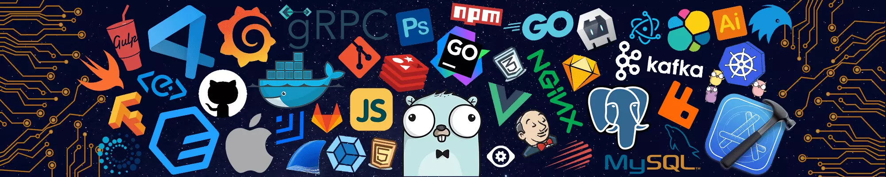

<!-- BANNER -->

  

<h1 align="center">
  ✏️ <strong>André Santos</strong> 
  IA Maker + DevOps + API Engineer
</h1>

  <strong style="color:#ffcc00;">Conectando APIs e Automatizando Mundos Reais</strong> 
  Futuro com DevOps, N8N, Docker e JavaScript

---

## ⚙️ Sobre mim

✅ Carioca, vibe roots-tech, com Jesus no coração e código na mente.  
🧠 Desenvolvedor com foco em IA aplicada, automações com N8N e sistemas escaláveis.  
🚀 Crio soluções para integrar negócios ao futuro — com tecnologia,  
❤️ Preformesco e pronósito.

---

## 📊 GitHub Stats

<table>
  <tr>
    <td>
      
    </td>
    <td>
      
    </td>
  </tr>
</table>

---

## 🐍 Snake Eating My Contributions

  

---

## 🧪 Pilha de tecnologia atual

  
  
  
  
  

---

## 🌐 Onde me encontrar

  
  
  
  
  
  

---

  <i>"Tecnologia com propósito muda vidas."</i>

